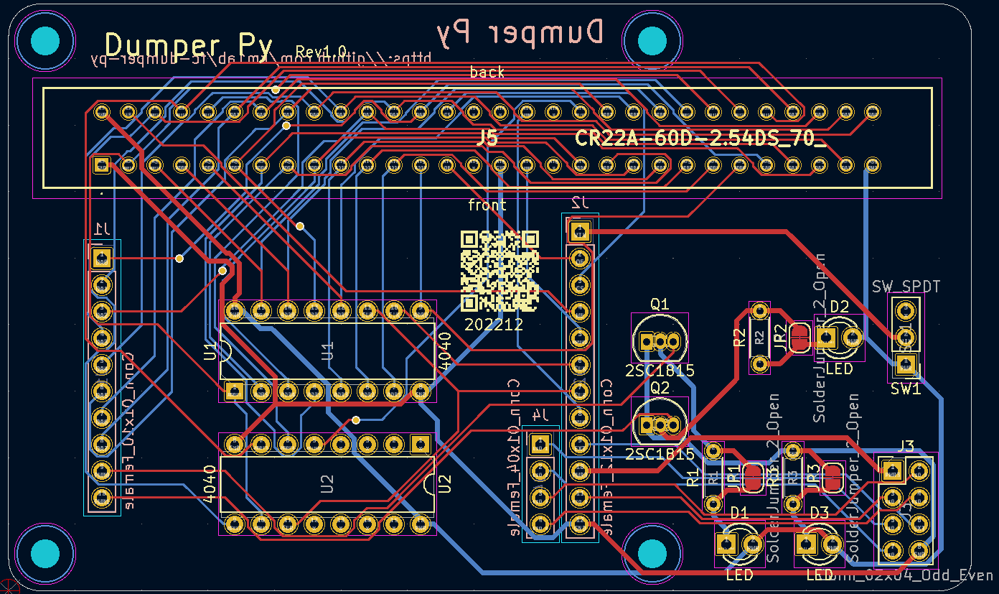
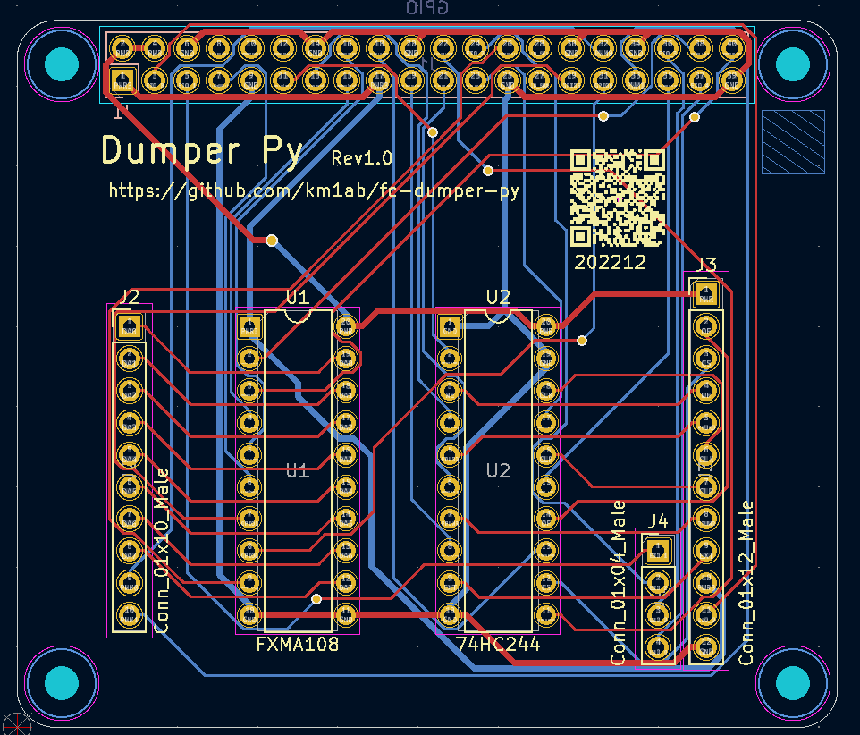

# FC dumper py

FC dumper by Python

## Environment
- Raspberry pi 3 b+, or later
- Raspberry pi zero, or later

## How to use
At Raspberry pi, or remote connecting (ex ssh,...)
```
pip install RPi.GPIO
python3 sfc-dumper.py filename
```

## Hardware

### PCB design

#### top PCB


#### bottom PCB

