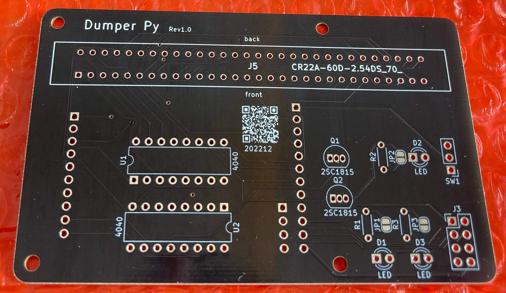
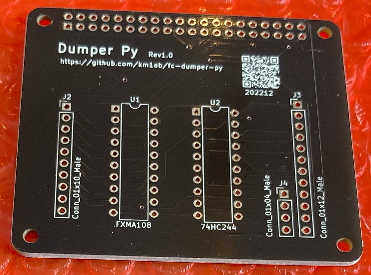
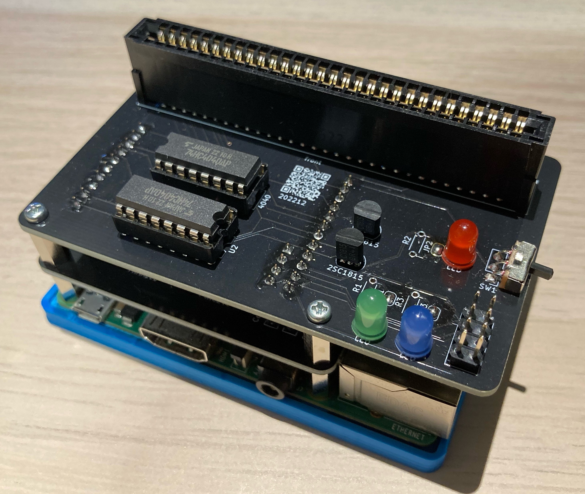
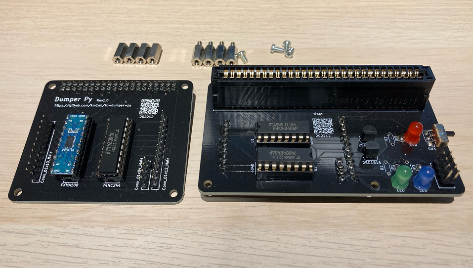
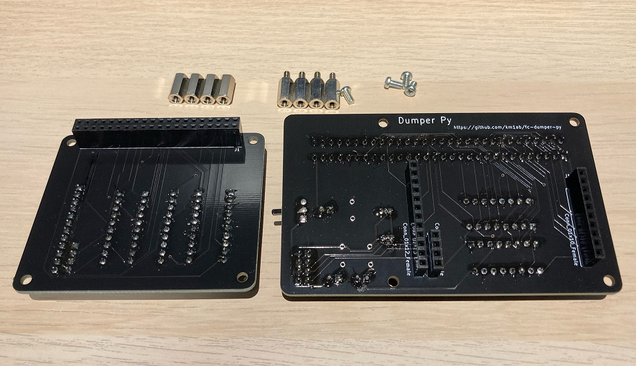
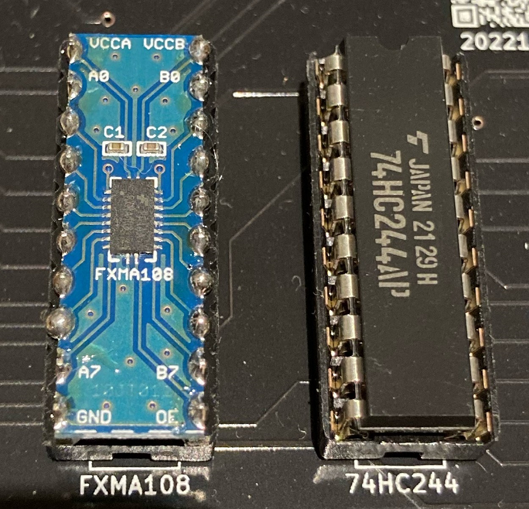

# FC dumper py

- Dumper for fc by Python.
- This dumper is a HAT for Raspberry Pi and we also publish the source code to make it work in this repository.

## Environment
- Raspberry pi 3 b+, or later
- Raspberry pi zero, or later

## How to use
At Raspberry pi, or remote connecting (ex ssh,...)
```
pip install RPi.GPIO
python3 fc-dumper.py -o filename
```

```
$ python3 fc_dumpter.py --help
usage: fc_dumpter.py [-h] [-o OUTPUT_FILE] [-p {8K,16K,32K}] [-c {1K,8K,16K,32K}] [-a {mapper0,mapper1,mapper3,mapper66,mapper23}] [-m {dumper,led_test}] [-d [DEBUG]] [-i [INFO]] [-s SIZE]
                     [-D [LED_DUTY ...]] [-F [LED_FREQ ...]] [-N [LED_NUMBER ...]] [-T LED_TIME]

options:
  -h, --help            show this help message and exit
  -o OUTPUT_FILE, --output_file OUTPUT_FILE
                        output file name; (default: output.nes)
  -p {8K,16K,32K}, --prg_rom_size {8K,16K,32K}
                        program rom size select; (default: 16K)
  -c {1K,8K,16K,32K}, --chr_rom_size {1K,8K,16K,32K}
                        charactor rom size select; (default: 8K)
  -a {mapper0,mapper1,mapper3,mapper66,mapper23}, --mapper {mapper0,mapper1,mapper3,mapper66,mapper23}
                        mapper select; In mapper 23, specify the size of the bank in options '-p' and '-c'. (default: mapper0)
  -m {dumper,led_test}, --mode {dumper,led_test}
                        mode (default: dumper)
  -d [DEBUG], --debug [DEBUG]
                        debug log (default: False)
  -i [INFO], --info [INFO]
                        game infomation (default: False)
  -s SIZE, --size SIZE  read size (default: 256)
  -D [LED_DUTY ...], --led_duty [LED_DUTY ...]
                        LED testing only (default: [1])
  -F [LED_FREQ ...], --led_freq [LED_FREQ ...]
                        LED testing only (default: [20])
  -N [LED_NUMBER ...], --led_number [LED_NUMBER ...]
                        LED testing only (default: [0])
  -T LED_TIME, --led_time LED_TIME
                        LED testing only (default: 5)
```

## Hardware
- PCB-top

- PCB-bottom


## Parts list
必須


| 名称                             | 数量 | 入手先      | 備考                                                                      |
|--------------------------------|----|----------|-------------------------------------------------------------------------|
| PCB-top (rev1.0)               | 1  | 頒布予定     | 本ページのHardwareを参照                                                        |
| PCB-bottom (rev1.0)            | 1  | 頒布予定     | 本ページのHardwareを参照                                                        |
| ラズパイ 3 b+                      | 1  | メルカリ？など  | ラズパイ5が発売されました。少々高いですが、容量の少ない方が比較的入手しやすいようです。2024/03現在。                    |
| CR22A-60D-2.54DS(70)           | 1  | ⇒⇒⇒      | googleにて、CR22A-60D-2.54DS(70)で検索すると、ある程度ヒットします。                         |
| 抵抗内蔵５ｍｍＬＥＤ（※）                  | 1  | 秋月電子     | https://akizukidenshi.com/catalog/g/gI-12517/                           |
| 小型スライドスイッチ　１回路２接点              | 1  | 秋月電子     | https://akizukidenshi.com/catalog/g/gP-12723/                           |
| 8ビット双方向ロジックレベル変換モジュール（FXMA108） | 1  | 秋月電子     | https://akizukidenshi.com/catalog/g/g104522/                            |
| 74HC244                        | 1  | マルツオンライン | https://www.marutsu.co.jp/GoodsDetail.jsp?salesGoodsCode=37576&shopNo=3 |
| 74HC4040                       | 2  | マルツオンライン | https://www.marutsu.co.jp/pc/i/18963/                                   |
| Raspberry Pi専用スペーサー（MPS-M2611） | 1  | サンハヤト    | https://shop.sunhayato.co.jp/products/mps-m2611                         |
| 六角オネジ・メネジ　ＭＢ２６－１１              | 4  | 秋月電子     | https://akizukidenshi.com/catalog/g/gP-11546/                           |
| ピンソケット (メス) 2×20 (40P)         | 1  | 秋月電子     | https://akizukidenshi.com/catalog/g/g100085/                            |
| ピンソケット(メス) 1×12(12P)           | 1  | 秋月電子     | https://akizukidenshi.com/catalog/g/g110101/                            |
| ピンソケット(メス) 1×10(10P)           | 1  | 秋月電子     | https://akizukidenshi.com/catalog/g/g103786/                            |
| ピンヘッダ 1×4 (4P)　10個入り（※）        | 1  | 秋月電子     | https://akizukidenshi.com/catalog/g/g103950/                            |
| ピンヘッダ 1×40 (40P)               | 1  | 秋月電子     | https://akizukidenshi.com/catalog/g/g100167/                            |
| ICソケット (16P)　10個入り（※）          | 1  | 秋月電子     | https://akizukidenshi.com/catalog/g/g100007/                            |
| ICソケット (20P)　10個入り（※）          | 1  | 秋月電子     | https://akizukidenshi.com/catalog/g/g100009/                            |

※LEDは、いかにも電源ONでスライドスイッチ真横のLED(D2)が光りそうですが、実際D3の方が光ります。<br>
　また、必ずしも内臓抵抗のものである必要がありません。<br>
　5mm LEDと抵抗の組み合わせでも良いです。<br>
　回路図をご覧頂くとわかるかと思います。<br>
※ピンヘッダ 1×4 (4P)は、1個しか使いません。バラで購入できるならそれで問題ありません。<br>
※ICソケットはそれぞれ2個使います。バラで購入できるならそれで問題ありません。<br>
　ただ、ICソケットは有りでも無しでも好きな方で。<br>

#### オプション
- 抵抗内蔵５ｍｍＬＥＤ x2
- トランジスタ　２ＳＣ１８１５ x2
- ※抵抗内蔵LEDを使わない場合は、抵抗x3（抵抗値はLEDのスペックによる）
- Bottom ケース：3Dプリンタで作りました　(データ：)
- ピンヘッダ 2×20 (40P) ※2x4(8P)分しか使いません。デバッグ用なので無くても問題ありせん。
### 完成図
- ラズパイと接続するとこのような見た目になります。
- ２段のスタック構造になっています。
- ※Raspberry Pi専用スペーサーのナットは使いませんでした。



### 分割した様子
#### face and bottom
- face

- bottom


### 留意事項
#### FXMA108の取り付けについて
  - FXMA108のキットは、付属のピンヘッダをそのまま取り付けると、隣のHC244より背が高くなります。
  - PCB-TOPをスタックする時に干渉してしまいますので、ピンヘッダの足を適当な長さに切りそろえて下さい。
  - また、付属のピンヘッダの足は太いので、ICソケットに若干強引に差し込みます（問題なくささりますが）。
  - なので、気になる方は細ピンヘッダを使うと良いかもしれません。



### PCB design

#### top PCB


#### bottom PCB

